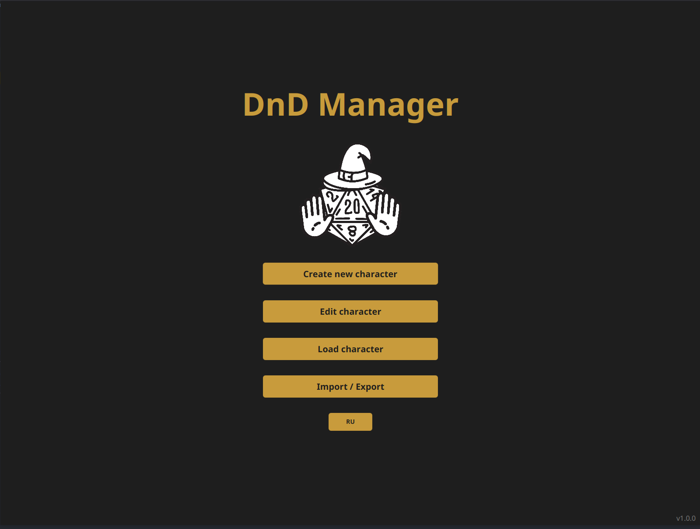
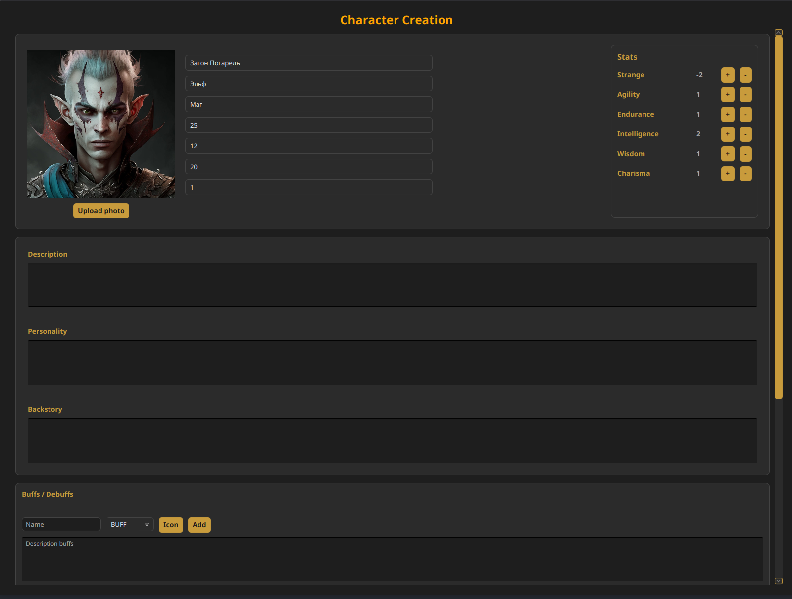
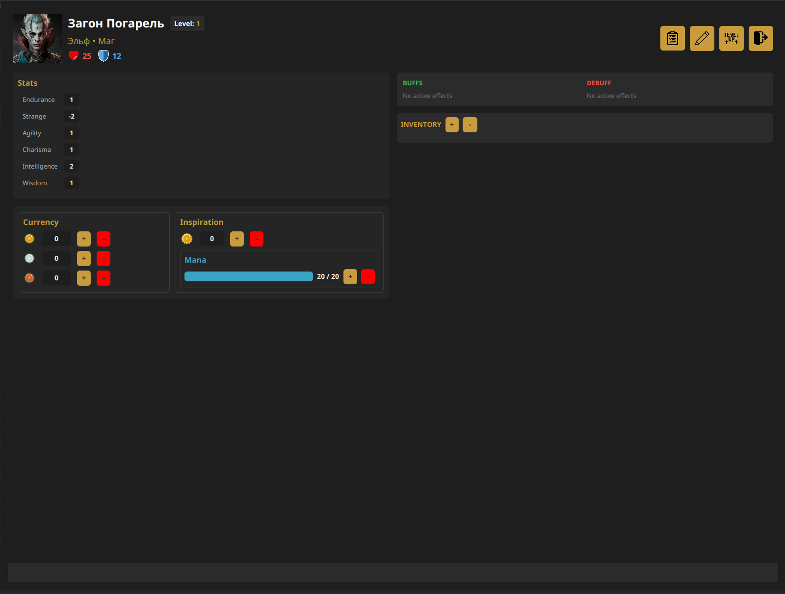

# 🛡️ DnD Manager

**DnD Manager** — это твой верный спутник в мире настольных ролевых игр. Приложение создано для игроков, которым надоело копаться в бумажках и хочется сосредоточиться на бросках кубиков и отыгрыше.

---

## 📸 Скриншоты

|              Главное меню               |             Создание персонажа              |            Игровой HUD            |
|:---------------------------------------:|:-------------------------------------------:|:--------------------------------:|
|  |  |  |

---

## ✨ Основные возможности

* **🧙‍♂️ Кузница Героев:** Полноценное создание и детальное редактирование персонажей. Больше никаких исправлений карандашом до дыр в листе!
* **🐾 Система фамильяров:** Создавай и настраивай верных спутников. Теперь твой фамильяр имеет свою карточку, статы и иконку.
* **⚔️ Эффекты и снаряжение:** Добавляй предметам магические свойства, баффы и активные навыки. Все бонусы учитываются в реальном времени.
* **📜 Генератор легенд:** Экспортируй краткое текстовое описание персонажа для быстрой отправки мастеру или сопартийцам.
* **💾 Магия Хранения:** Твои герои теперь в безопасности. Все данные и иконки хранятся в системной папке `%AppData%/Roaming`, что упрощает обновление приложения без потери прогресса.
* **🌍 Двуязычие:** Полная поддержка русского и английского языков.
* **🔄 Авто-апдейт:** Встроенная система проверки обновлений поможет всегда оставаться на актуальной версии (Beta).

---

## 🚀 Как запустить

Приложение является **полноценным Windows-приложением** и не требует установленной Java (Runtime уже включен в сборку).

### Для Windows:
1. Скачай архив `DnD_Manager_Windows.zip` из раздела **Releases**.
2. Распакуй его в любое удобное место.
3. Запусти файл `DnD_Manager.exe`. 
   * *Для отладки и просмотра логов можно использовать `debug_launcher.bat`.*

---

## 🤝 Обратная связь и поддержка

Нашли баг (может, это проклятие?) или есть крутая идея для улучшения приложения? Пишите напрямую!

* **Telegram:** [@JusteR_YT](https://t.me/JusteR_YT)
* **GitHub Issues:** Создайте тикет в этом репозитории.

**Да пребудет с тобой критический успех!** 🎲

---

## 📜 Лицензия

Проект распространяется под лицензией **MIT License**. Свободно используйте, меняйте и делитесь!
